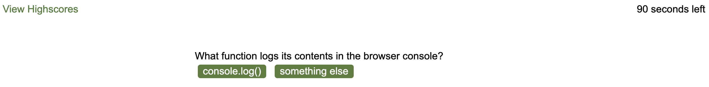

# A basic quiz application
This is a simple quiz application that begins with a start page before launching a timed quiz. 

;

Correct answers earn 1 point, incorrect answers earn 0 and result in a 5 second demerit on remaining time. 
;

At the end of the quiz, the total score is a combination of points and seconds remaining. The user can then choose whether or not to add their initials and score to a highscores page that pulls from local storage. 

;

# Motivation
This project offered an opportunity to practive DOM manipulation and using local storage.

# Known bugs
There is currently a bug in the question flow that fires after the second question (regardless of what it is), skipping the third question and counting the response to #2 as the response to #3. Also, the highscores page doesn't currently save individual scores. 
 
# Credits
Code for styling (and other minor aspects of this application) was provided by the UNC-Chapel Hill coding bootcamp. 